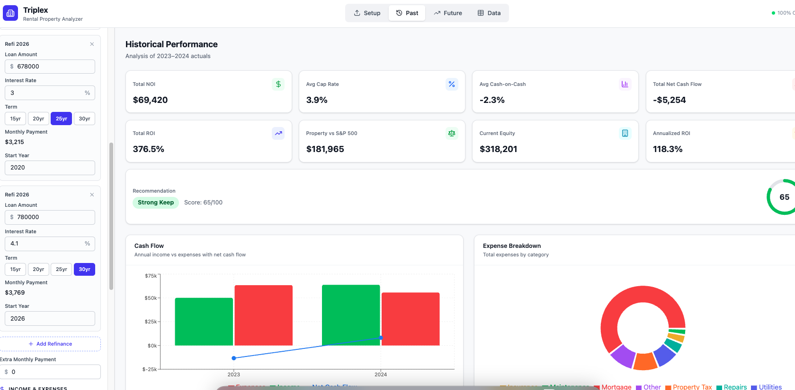
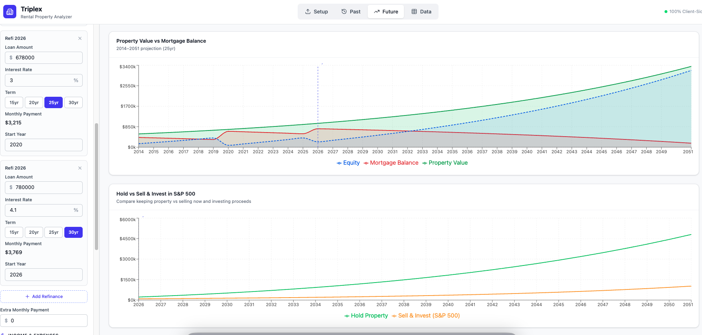
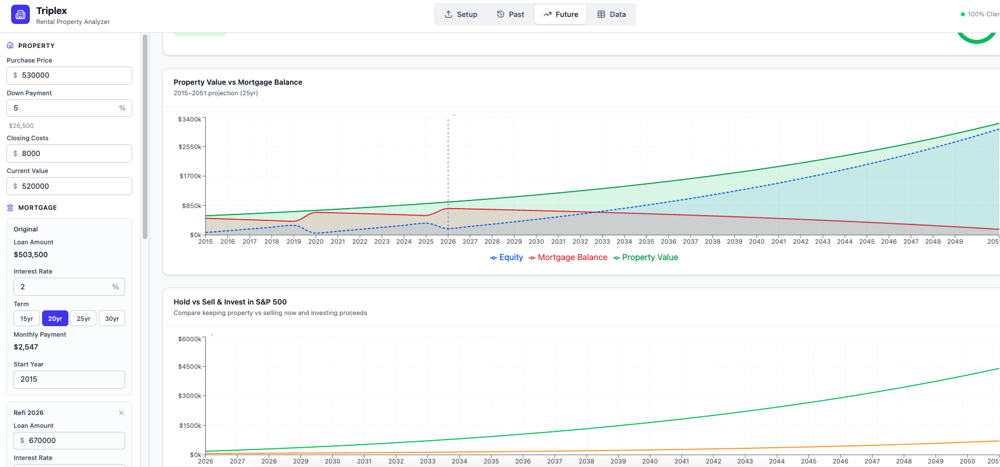
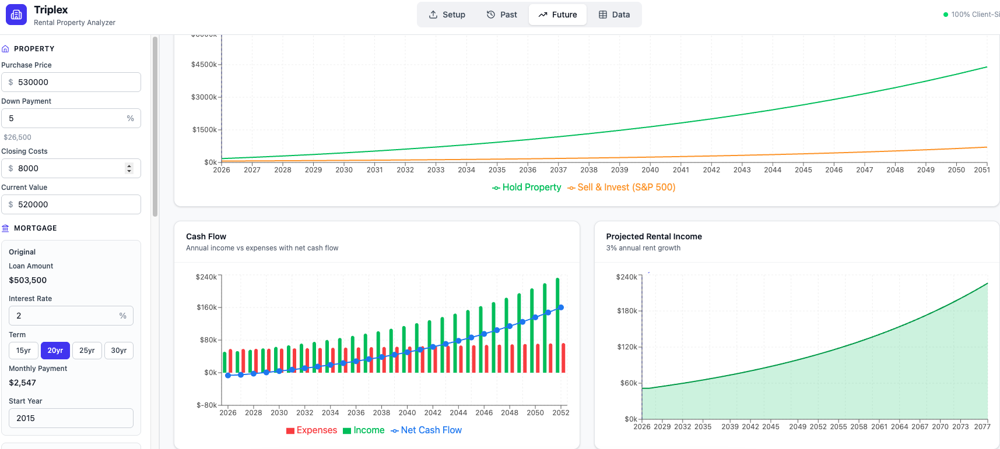

# RentalAnalyzer

A comprehensive **rental property profitability analyzer** built entirely client-side with React, TypeScript, and Vite. Evaluate whether to buy, hold, or sell investment properties with detailed financial projections, mortgage tracking, and side-by-side S&P 500 comparisons.



## Getting Started

### Prerequisites

- [Node.js](https://nodejs.org/) (v18 or higher)
- npm or yarn

### Installation

```bash
# Clone the repository
git clone https://github.com/roseoflife/RentalAnalyzer.git
cd RentalAnalyzer

# Install dependencies
npm install

# Start the development server
npm run dev
```

The app will be available at `http://localhost:5173`.

### Build for Production

```bash
npm run build
npm run preview
```

## Features

### Property Configuration
Configure your property details directly in the sidebar — purchase price, down payment percentage, closing costs, and current market value. All metrics recalculate instantly as you adjust values.

### Refinance & Multi-Mortgage Support
Track multiple mortgage periods with the **Add Refinance** button. Each period supports its own loan amount, interest rate, term (15/20/25/30 years), and start year. Monthly payments are auto-calculated. You can also model extra monthly payments to see accelerated payoff impact.



### Manual Income & Expense Entry
Enter monthly rent, other income, and vacancy rate directly in the sidebar. Expand the **Annual Expenses** section to input property tax, insurance, maintenance, repairs, management fees, utilities, HOA, capital expenditures, and other costs. Records are auto-generated for the current year.

### CSV / Excel Upload
Upload income and expense data via CSV or Excel files with flexible column mapping. Supports separate income/expense files or a single combined file. A **Load Sample Data** button generates 10 years of demo data to explore the app immediately.

### Data Persistence
All configuration, income, and expense data is automatically saved to `localStorage`. Refresh the page and everything is restored exactly as you left it.

---

## Charts & Analysis

### Cash Flow Chart
Visualizes annual income (green bars), expenses (red bars), and net cash flow (blue line) over time.


### Expense Breakdown
Pie chart showing how total expenses are distributed across categories — mortgage, property tax, insurance, maintenance, and more.


### Property Value vs Debt
Area chart projecting property value, mortgage balance, and equity over 25 years based on your appreciation rate and mortgage terms.



### Equity Buildup
Stacked area chart breaking down equity growth into three components: initial down payment, cumulative principal paydown, and appreciation gains.


### ROI Comparison: Property vs S&P 500
Line chart comparing your total property wealth against what you'd have earned investing the same cash (including annual cash flows) into the S&P 500. This is a fair apples-to-apples comparison that reinvests property cash flows on both sides.


### Hold vs Sell & Invest
Compares the wealth outcome of continuing to hold the property versus selling today (after selling costs and capital gains tax) and investing the proceeds in the S&P 500.



### Rent Growth Projections
Area chart projecting rental income growth over time based on your configured rent growth rate.

---

## Summary & Recommendations

The dashboard displays 8 key metric cards:

| Metric | Description |
|--------|-------------|
| **Total NOI** | Net Operating Income across all years |
| **Avg Cap Rate** | Average capitalization rate |
| **Avg Cash-on-Cash** | Average annual return on cash invested |
| **Total Net Cash Flow** | Cumulative cash flow after all expenses |
| **Total ROI** | Total return on investment including appreciation, principal paydown, and tax benefits |
| **Annualized ROI** | Geometric mean annual return |
| **Property vs S&P 500** | Side-by-side wealth comparison |
| **Current Equity** | Current property value minus loan balance |

A **Recommendation Engine** scores the property using weighted factors and provides a buy/hold/sell verdict with detailed reasoning — highlighting both positive and negative aspects of the investment.

---

## Data Tables

- **Annual Summary Table** — Sortable table with year-by-year financials: EGI, operating expenses, NOI, mortgage payments, net cash flow, cap rate, cash-on-cash, property value, equity, and ROI.
- **Mortgage Schedule** — Toggle between annual and monthly views showing payment, principal, interest, and remaining balance. Handles multi-period mortgages with visual separation.
- **Raw Data Viewer** — Browse uploaded income and expense records by year and month.

---

## Tech Stack

- **React 18** + **TypeScript**
- **Vite** for development and builds
- **Tailwind CSS v4** for styling
- **Recharts** for all charts and visualizations
- **PapaParse** for CSV parsing
- **SheetJS (xlsx)** for Excel file support
- **Lucide React** for icons
- 100% client-side — **no backend required**

## License

MIT
